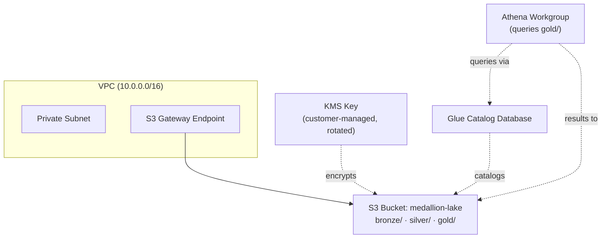
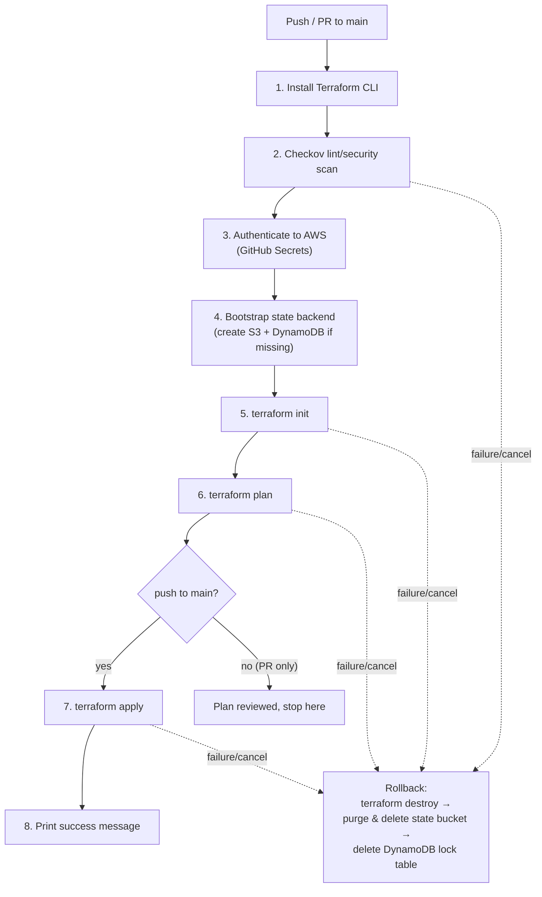

# Terraform-Automation-using-Github-Actions — CI/CD Infrastructure Automation

Minimal, single-environment AWS infrastructure for a small-business Medallion
(Bronze/Silver/Gold) data lake, provisioned entirely through Terraform and
deployed via GitHub Actions. This repo covers **infrastructure only** — no
ETL jobs, ingestion code, or transformation logic live here.

## What gets built

| Layer | Purpose |
|---|---|
| VPC + S3 Gateway Endpoint | Keeps S3 traffic off the public internet at no extra cost |
| VPC flow logs (CloudWatch) | Records accepted/rejected traffic for the VPC |
| Locked-down default security group | Default SG denies all traffic instead of the AWS default "allow from self" |
| KMS customer-managed key (explicit policy) | Encrypts everything at rest |
| S3 bucket (`bronze/`, `silver/`, `gold/`) | The data lake itself, versioned, with a lifecycle rule |
| S3 access-log bucket | Receives server access logs from the data lake bucket (and logs to itself) |
| Glue Catalog database | Metadata catalog for the lake |
| Athena workgroup | Query engine over the Gold layer, enforced KMS encryption |

### Security scanning notes

This project is scanned with Checkov on every pipeline run (`soft_fail: false`
— findings block the deploy). Two checks are intentionally skipped via
`.checkov.yaml`, both with justification comments in that file:

- `CKV2_AWS_62` (S3 event notifications) — no consumer wired up yet
- `CKV_AWS_144` (S3 cross-region replication) — out of scope for a
  single-region small-business setup; would need a second bucket in a
  second region plus a replication IAM role

If you run Checkov yourself, pass the config explicitly or skips won't
apply: `checkov --config-file .checkov.yaml`.

## Architecture



## CI/CD Pipeline Flow



**Key behavior:** the S3 state bucket and DynamoDB lock table are created
fresh by the pipeline itself, before any project infrastructure, and are
torn down again — along with anything Terraform managed to provision — if
any step fails or the run is cancelled. There is no persistent backend
sitting between runs.

## Directory Structure

```text
.
├── .github/
│   └── workflows/
│       └── deploy.yml            # CI/CD: lint → plan → apply → rollback-on-failure
├── .checkov.yaml                  # Checkov scan config (shared by CI and local runs)
├── .gitignore                     # Keeps state, plans, and *.tfvars out of git
├── backend.tf                     # S3 backend block (config injected at init time)
├── main.tf                        # VPC, KMS, S3 data lake, Glue, Athena
├── variables.tf                   # aws_region, environment_name
├── outputs.tf                     # bucket name, KMS ARN, VPC id, etc.
├── terraform.tfvars.example       # Copy to terraform.tfvars for local runs
└── README.md
```

## One-time setup

1. In the GitHub repo, go to **Settings → Secrets and variables → Actions**
   and add:
   - `AWS_ACCESS_KEY_ID`
   - `AWS_SECRET_ACCESS_KEY`
2. Those credentials need permissions to manage VPC, S3, KMS, Glue, Athena,
   DynamoDB, and IAM `sts:GetCallerIdentity`. Scope them to a dedicated CI
   user/policy rather than reusing an admin key.
3. Push to `main` (or open a PR to see the plan without applying).

## Running locally (optional)

The pipeline doesn't need this, but to run Terraform or Checkov from your
own machine:

```bash
cp terraform.tfvars.example terraform.tfvars   # edit values if needed
terraform init -backend=false                  # skip remote backend for local-only checks
terraform validate
checkov --config-file .checkov.yaml
```

## Dependencies

- Terraform `>= 1.5.0`
- AWS CLI (preinstalled on `ubuntu-latest` GitHub runners)
- [Checkov](https://www.checkov.io/) — policy-as-code security/lint scan
- `jq` (preinstalled on `ubuntu-latest`) — used during rollback to purge
  versioned S3 objects
- GitHub Secrets: `AWS_ACCESS_KEY_ID`, `AWS_SECRET_ACCESS_KEY`

## Notes and trade-offs (read before relying on this in production)

- **`force_destroy = true`** on the data bucket is what makes automatic
  rollback possible, but it also means a failed pipeline run will delete
  real data in the bucket, not just the bucket shell. Fine for a
  fresh/small project; flip to `false` once the lake holds data you can't
  regenerate.
- **Static AWS keys in GitHub Secrets** were used because that's what was
  asked for. GitHub's OIDC-to-AWS-role federation avoids storing long-lived
  keys at all and is worth moving to later — it's a small workflow change.
  Static keys have no built-in rotation or expiry, so rotate manually.
  Nothing in this design requires them, and there is nothing project
  specific in the state.
- **Concurrency:** the workflow is limited to one run at a time
  (`concurrency:` block) because two simultaneous runs would fight over the
  same state bucket name.
- **Checkov is set to hard-fail** (`soft_fail: false`), i.e. it actually
  blocks the pipeline on findings, not just warns. Set it to `true` if you'd
  rather tune the ruleset gradually before enforcing it.
